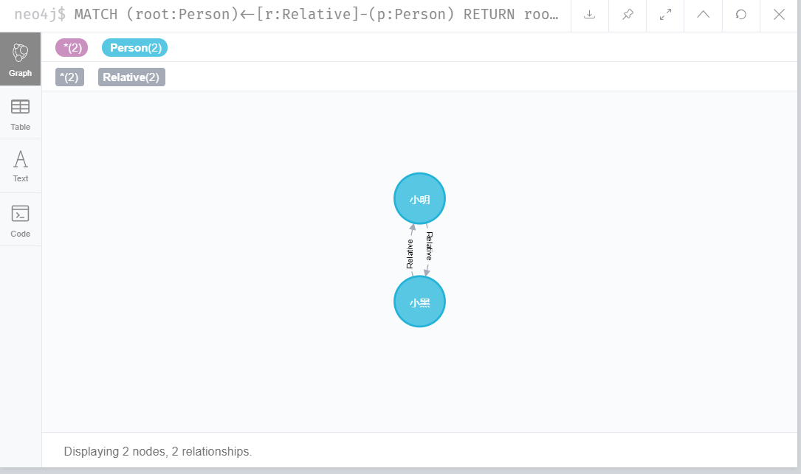

# spring-neo4j 成员关系管理后端

> 这个项目简单的模拟了一些人与人之间的关系信息, 使用了```neo4j```数据库作为管理成员信息;

### 项目使用

* IDEA 2020.1
* SpirngBoot
* neo4j
* swagger

### 项目思路

本项目采用的是```@EnableNeo4jRepositories```的方式来进行对```neo4j```做交互动作, 这样做的好处是简单方便, 能快速的让项目跑起来, 对于不太了解**SQL语句**有很大的帮助, api调试使用的swagger作为调试工具

首先举一个例子, 假如有两个人下方表格, 实体类代码地址: [```Person.java```](https://github.com/chenmoand/spring-neo4j/blob/master/src/main/java/io/github/chenmoand/springneo4j/bean/Person.java) 测试代码地址: [```Code```](https://github.com/chenmoand/spring-neo4j/blob/master/src/test/java/io/github/chenmoand/springneo4j/SpringNeo4jApplicationTests.java#L34)

| 姓名 | 年龄 | 性别 | 关系         |
| ---- | ---- | ---- | ------------ |
| 小明 | 18   | 男   | 是小黑的弟弟 |
| 小黑 | 20   | 男   | 是小明的哥哥 |

因为关系的互相咬合, 形成了一种关系网关系如下图(noe4j客户端)



后台也提供了相应的接口来返回, 这里我使用的是@Query 让spring帮我们生成代码和SQL逻辑

``` java
@Query("MATCH (root:Person)<-[r:Relative]-(p:Person) " +
       "WHERE root.name='{name}' RETURN root, r, p"
)
Set<Person> graphByName(@Param("name") String name);

@Query("MATCH (root:Person)<-[r:Relative]-(p:Person) RETURN root, r, p")
Set<Person> graph();
```

